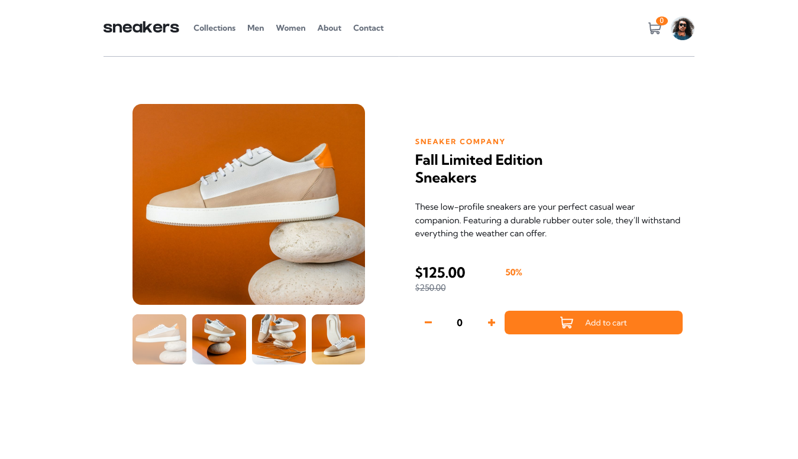

# Frontend Mentor - E-commerce product page solution

This is a solution to the [E-commerce product page challenge on Frontend Mentor](https://www.frontendmentor.io/challenges/ecommerce-product-page-UPsZ9MJp6). Frontend Mentor challenges help you improve your coding skills by building realistic projects.

## Table of contents

- [Overview](#overview)
  - [The challenge](#the-challenge)
  - [Screenshot](#screenshot)
  - [Links](#links)
- [My process](#my-process)
  - [Built with](#built-with)  
  - [Continued development](#continued-development)
  - [Useful resources](#useful-resources)
- [Author](#author)
- [Acknowledgments](#acknowledgments)

## Overview

### The challenge

Users should be able to:

- View the optimal layout for the site depending on their device's screen size
- See hover states for all interactive elements on the page
- Open a lightbox gallery by clicking on the large product image
- Switch the large product image by clicking on the small thumbnail images
- Add items to the cart
- View the cart and remove items from it

### Screenshot

### Links

- Solution URL: [Add solution URL here](https://github.com/bobb-Rob/ecommerce-product-page/tree/main)
- Live Site URL: [Add live site URL here](https://bobb-rob.github.io/ecommerce-product-page/)

## My process

### Built with

- Semantic HTML5 markup
- CSS with:
  - Flexbox
  - CSS Grid
- Mobile-first workflow
- Gitflow
- JavaScript 

### Continued development

I still feel like much of my code could be more DRY. In the future, I wish to improve the reusability of many functions

### Useful resources

- [Example resource 1](https://www.w3schools.com/howto/howto_js_slideshow_gallery.asp) - This helped me for implementing the lightbox.

## Author

- Website - [Robertson Akpan](https://bobb-rob.github.io/portfolio-project-1/)
- Frontend Mentor - [@bobb-rob](https://www.frontendmentor.io/profile/bobb-rob)

- GitHub: [@bobb-rob](https://github.com/bobb-Rob)
- Twitter: [@\_\_\_Robertson](https://twitter.com/___Robertson)
- LinkedIn: [RobertsonAkpan](https://www.linkedin.com/in/robertson-akpan-6895a0123/)

## Acknowledgments

Acknowledge Frontend Mentor team for the good putting this challenge out there.
